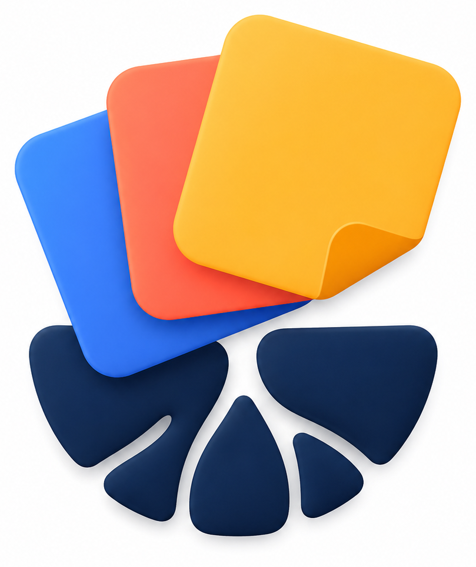
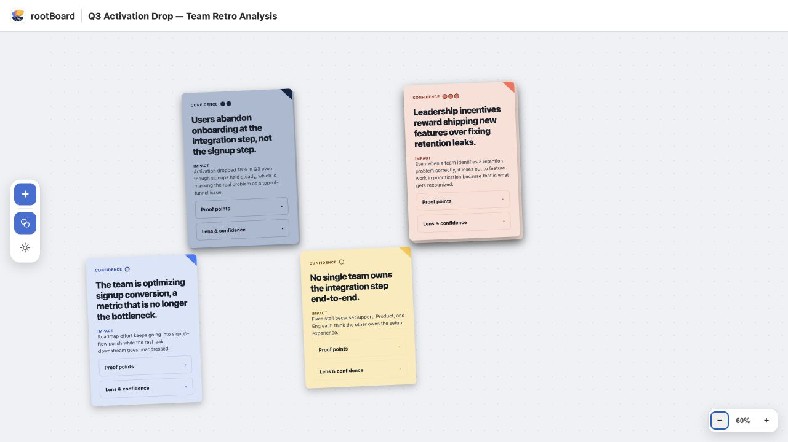

<p align="center">
  
</p>
<h1 align="center">rootBoard</h1>
<p align="center">
  Turn meeting transcripts and messy context into an editable map of the problems underneath.
</p>

rootBoard is an agent skill for Claude Code and Codex. It sends the same input
through several independent problem-identification lenses, compares where
they converge or disagree, and produces a self-contained sticky-note
whiteboard for sharpening the result.

It frames problems; it deliberately does not jump ahead to solutions.



<p align="center"><em>Sample board generated from the repository's fictional Q3 activation-retro fixture.</em></p>

## Why rootBoard

Meeting notes usually mix symptoms, proposed fixes, assumptions, and root
causes together. A single analysis pass can easily inherit the room's framing.
rootBoard creates useful friction:

- It selects two to four lenses that fit the input.
- Each lens works independently, without seeing the others' findings.
- A synthesizer preserves real disagreement instead of forcing consensus.
- Every board card carries its impact, source proof points, contributing
  frameworks, and confidence signal.
- The final HTML board can be moved or shared without a server or external
  assets.

## What a run produces

```text
Transcript or context dump
        ↓
Classify the situation and select useful lenses
        ↓
Run independent framework analyses in parallel
        ↓
Compare convergence, divergence, confidence, and blind spots
        ↓
Translate the synthesis into structured board data
        ↓
Build an interactive, self-contained whiteboard
```

By default, the complete run is saved at:

```text
~/Documents/rootBoard/runs/<run-name>/
```

The folder contains the original input, classification, each lens's findings,
the synthesis, structured board data, run status, `whiteboard.html`, and the
`latency.json` timing report. See
[`skills/rootboard/docs/invocation-and-runs.md`](skills/rootboard/docs/invocation-and-runs.md) for the complete
artifact contract.

## Install and run

You need Claude Code or Codex, Python 3.9 or newer, a modern browser, and a
host that can create isolated subagents. The helper scripts use only Python's
standard library; there are no packages to install and no build step.

Install the skill globally for Codex with the Skills CLI:

```bash
npx skills add kalkal87/rootBoard --skill rootboard --global --agent codex
```

Skills.sh handles discovery and installation. After installation, Codex runs
the skill when you invoke `$rootboard` or when a request clearly matches its
description.

For a source checkout, clone the repository:

```bash
git clone https://github.com/kalkal87/rootBoard.git
```

Then install the `skills/rootboard/` directory as the `rootboard` skill. The full
Claude Code and Codex instructions—including symlink, snapshot, update, and
smoke-test paths—are in
[`skills/rootboard/docs/sharing.md`](skills/rootboard/docs/sharing.md).

Example invocation:

```text
$rootboard Find the underlying problems in this transcript:
[paste transcript or context]
```

The runtime contract and routing instructions live in
[`skills/rootboard/SKILL.md`](skills/rootboard/SKILL.md).

## Privacy

rootBoard does not upload transcripts or run artifacts to a service of its
own. The selected AI host still processes the material under that host's own
terms. Run artifacts are plain files on the user's machine, saved outside the
current project by default. Treat them as sensitive whenever the input is
sensitive.

## Evaluation

Evaluation is maintained separately from the skill so scenarios and grading
material are not available to agents while they produce a run. Release results
can be published after blind evaluation without publishing the answer keys.

## Testing

The current local suites cover the deterministic orchestration helpers,
package and instruction routing, board-data translation and assembly, the
renderer core, browser-like DOM behavior, accessibility, and interactive
board state.

```bash
python3 -m unittest discover -s tests/python -p 'test_*.py' -v
node --test tests/javascript/*.test.js
```

The same suites run automatically in GitHub Actions. Run both commands locally
before preparing a release so installation and runtime changes fail early.

## Known V1 boundaries

- Board edits live in the current browser tab. Reloading restores the
  generated board; `synthesis.md` and `board-data.json` remain the durable
  record.
- Input is plain text or Markdown. PDF, Word, and audio conversion are not
  part of V1.
- rootBoard identifies and reframes problems; it does not recommend or
  implement solutions.
- Independent framework agents are required, so the host must support
  delegated agents.

## Repository guide

| Location | What it contains |
| --- | --- |
| [`skills/rootboard/`](skills/rootboard/) | The complete Skills.sh-compatible runtime package and its `SKILL.md`. |
| [`skills/rootboard/orchestration/`](skills/rootboard/orchestration/) | Coordinator instructions, agent briefs, workflow reference, and deterministic helpers. |
| [`skills/rootboard/prompts/`](skills/rootboard/prompts/) | Classifier, framework-agent, and synthesizer instructions. |
| [`skills/rootboard/frameworks/`](skills/rootboard/frameworks/) | The five packaged problem-identification recipes. |
| [`skills/rootboard/contracts/`](skills/rootboard/contracts/) | Findings, synthesis, board-data, and runtime-error contracts. |
| [`skills/rootboard/renderer/whiteboard/`](skills/rootboard/renderer/whiteboard/) | Dependency-free interactive whiteboard runtime. |
| [`skills/rootboard/examples/`](skills/rootboard/examples/) | Runtime examples for synthesis and failure behavior. |
| [`examples/renderer-fixtures/`](examples/renderer-fixtures/) | Development fixture used to exercise the renderer. |
| [`tests/`](tests/) | Python and JavaScript development tests, kept outside the installed skill. |

## License

rootBoard is available under the [MIT License](LICENSE).
